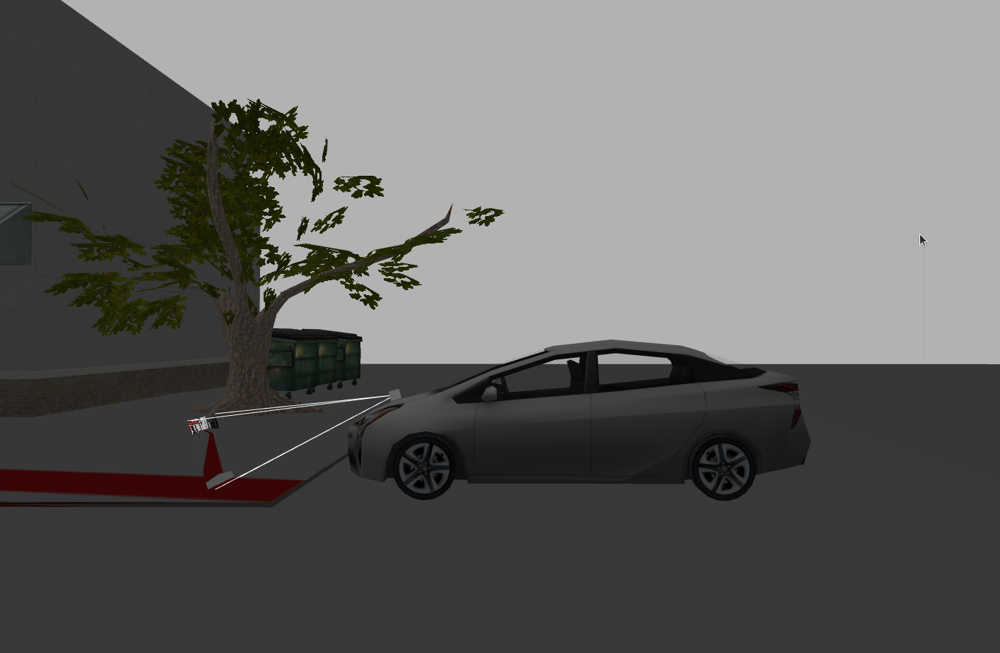
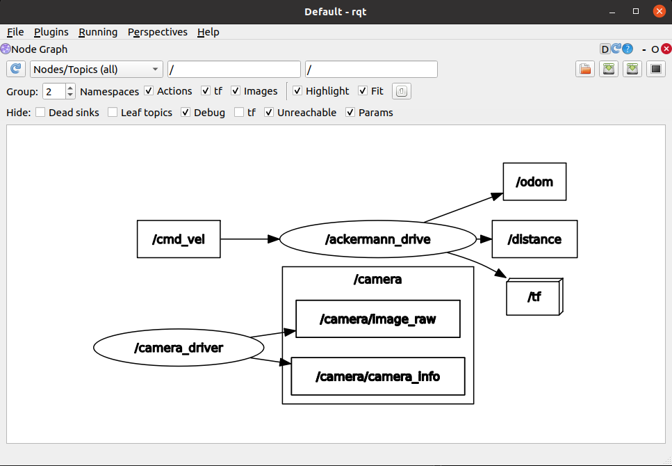
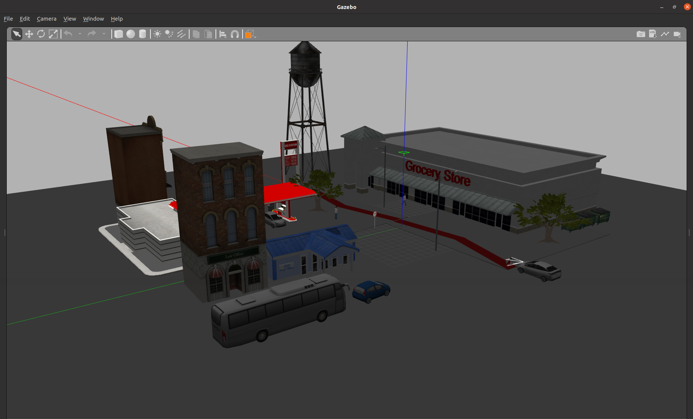
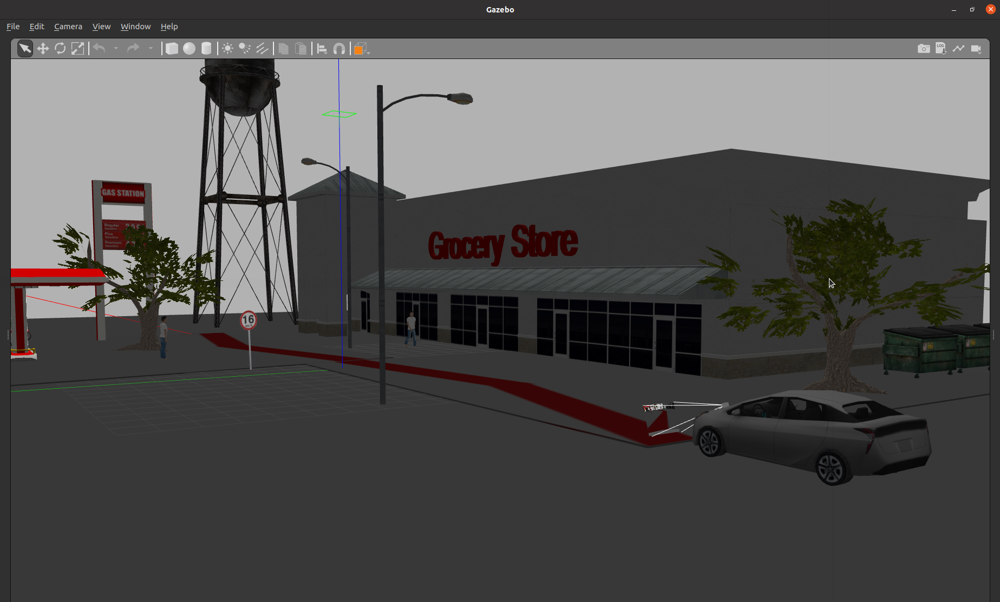
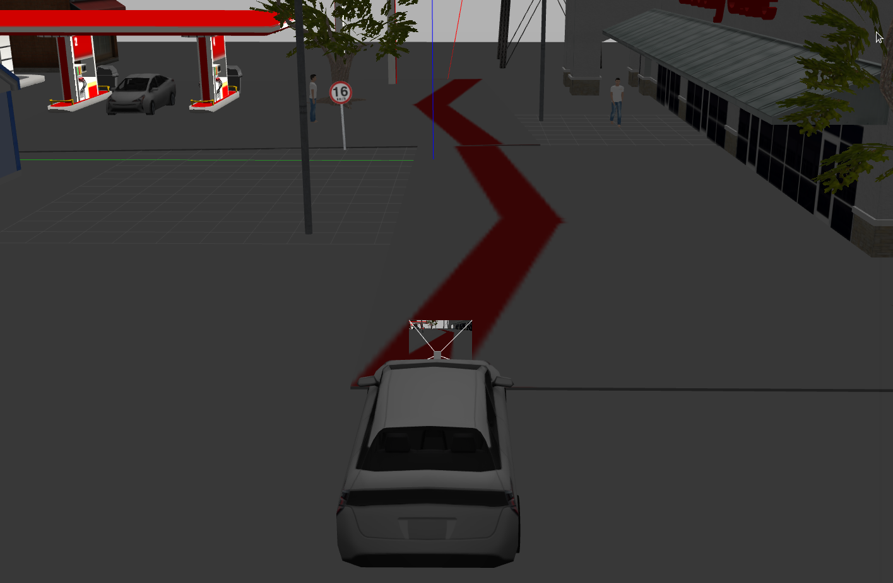
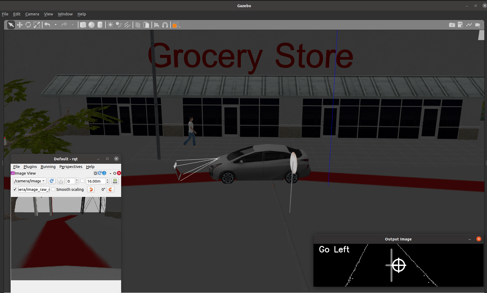
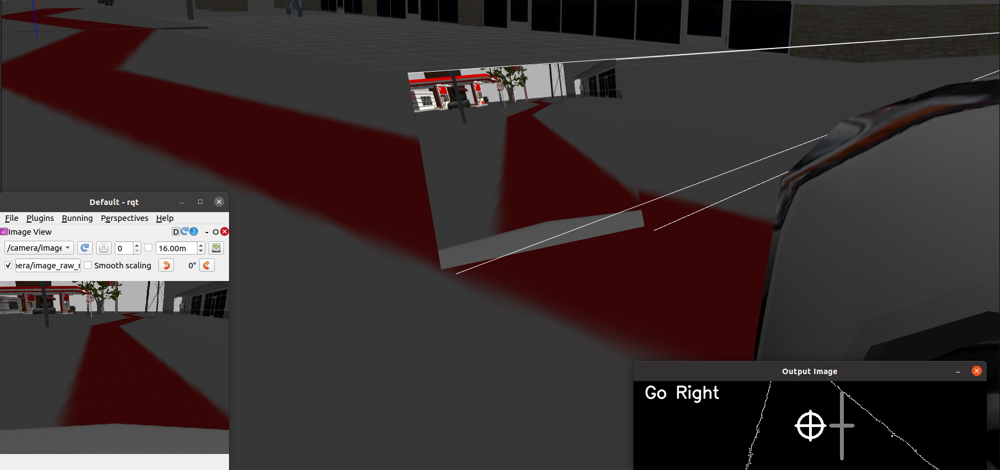
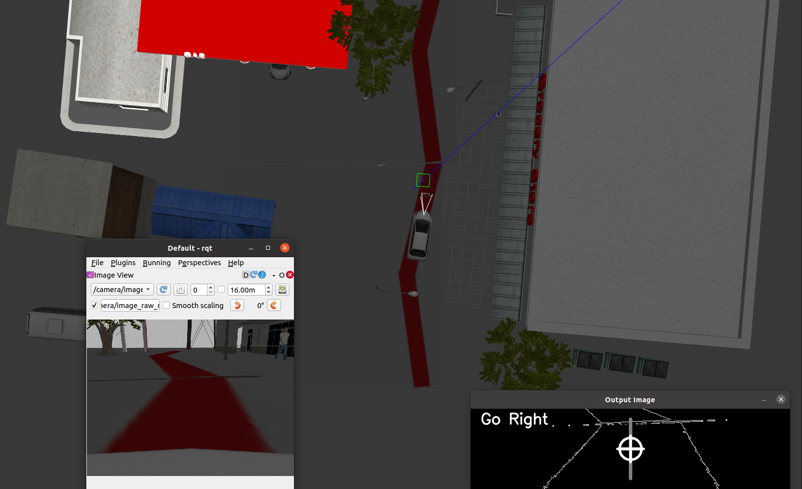

# Lane Following Simulation of a Toyota Prius 

**Goal -->** The goal of this project is to simulate a Lane Detection and Lane Following Toyota Prius in a Gazebo environment. All programs are written, tested and simulated using ROS 2 - Foxy Fitzroy.

  

## System Requirements
- Ubuntu 20.04
- ROS2 Foxy

## Algorithm Pipeline

  

## Perception Pipeline

Lane Detection and Lane Following:
- Perform Image Segmentation
- Perform CannyEdge Method
- Compare Lane center to Camera Frame center
- Calculate Orientation Error
- Correct Path by publishing updated velocities

## Images

  
  
  
  
  
  

## Results

The final result can be found in this [Video Link](https://drive.google.com/file/d/13d53jG-qHz8MxfdAAgOHgRX02tFpSac2/view?usp=sharing) 

  

## Support
For any questions, email me at jaisharm@umd.edu
